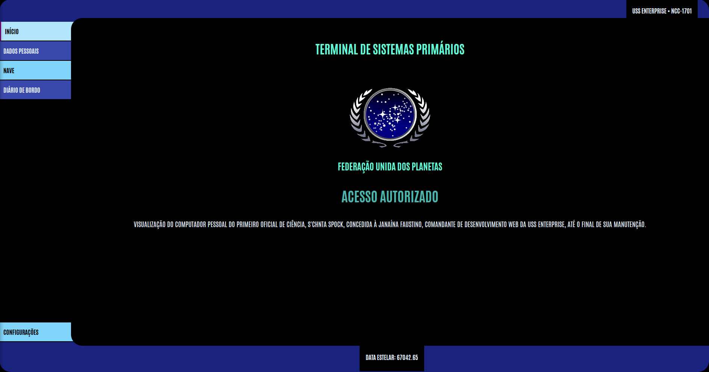

Helen Dessa, 5 BCC, 2025.1

# Interface LCARS - USS Enterprise NCC-1701

## Descrição do Projeto

Este projeto consiste em uma interface inspirada no LCARS (Library Computer Access/Retrieval System), o sistema computacional utilizado na série Star Trek. A interface simula um terminal de computador da nave estelar USS Enterprise NCC-1701, com funcionalidades que representam diferentes áreas da nave.

Ele foi adaptado, para simplificar o conteúdo e deixá-lo mais divertido, para ser temático Spock, um dos personagens da série.

## Funcionalidades

### Página Inicial
Terminal principal de acesso aos sistemas da nave, já se entra com acesso autorizado.

### Dados Pessoais
Visualização dos dados do Spock, como dados pessoais, histórico médico e habilidades.

### Nave
Mapa da USS Enterprise com algumas estatísticas importantes (umas baseadadas na série e outras somente por estética).

### Diário de Bordo
Registro de atividades do Spock, baseado em conteúdo da franquia.

### Recomendação
Página de receitas do Hannibal Lecter, fortemente recomendada pelo Spock, em um universo paralelo.
Volta ao site principal ao pressionar o botão "Voltar ao site principal" no final da página.

### Configurações
Painel de controle do sistema, ainda em fase de construção.

## Tecnologias Utilizadas

HTML e CSS.

## Status do Projeto

Em desenvolvimento. Pretendo desenvolver mais em outros trabalhos da disciplina ou por fora, visto que gosto bastante da série 
e foi divertido desenvolver o site.

## Como Executar

Abra o arquivo `index.html` em qualquer navegador para iniciar a experiência LCARS Spock.